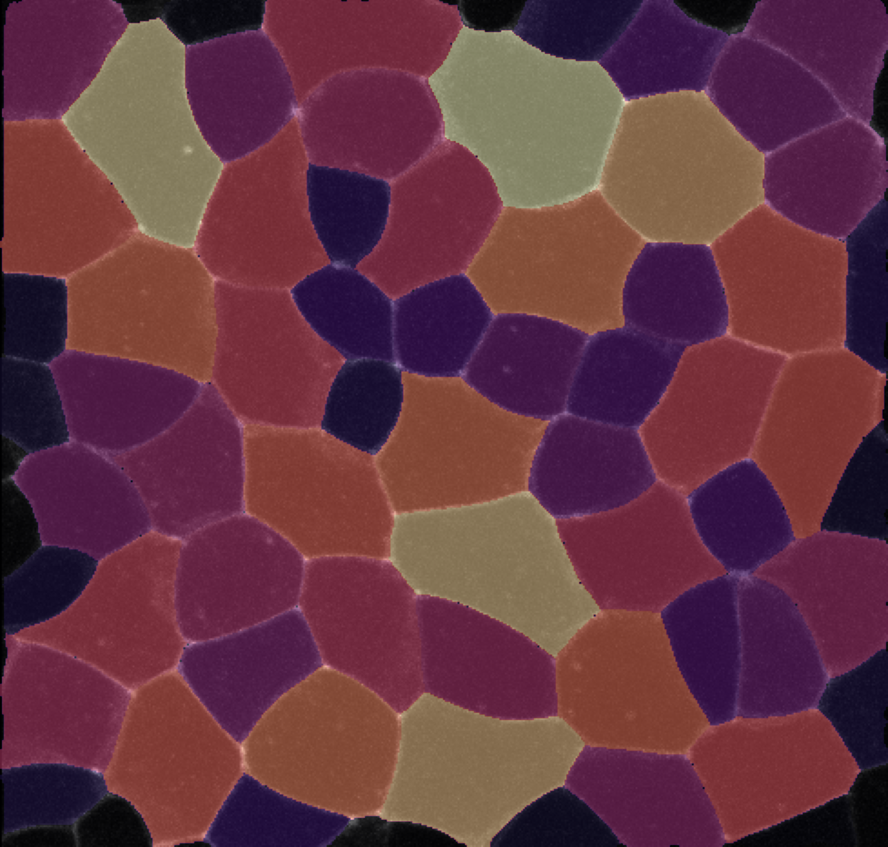

A minimal toolset for analyzing protein localization patterns and tissue structure in the _Xenopus laevis_ neural plate epithelium, supporting

Miho Matsuda, Jan Rozman, Sassan Ostvar, Karen Kasza, Sergei Sokol.  
**Mechanical control of neural plate folding by apical domain alteration**. Nature Communications 2023.  bioRxiv: https://doi.org/10.1101/2023.02.10.528047

     

## Sample Outputs

    <em>cell morphology and tissue structure</em>  
    
    

    <em>cell outline networks</em> 
     

    <em>junction morphology</em> 
     

    
    <em>junction intensities</em> 
    

## Dependencies 
- scikit-image
- numpy 
- [sknw](https://github.com/Image-Py/sknw)

## Authors
[Sassan Ostvar](https://github.com/sassanostvar) and [Karen Kasza](https://github.com/kaszalab)